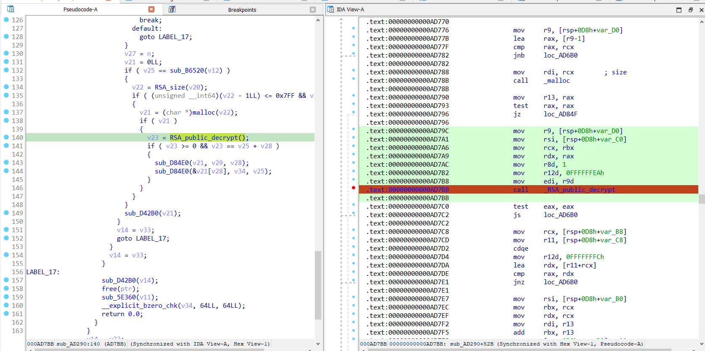
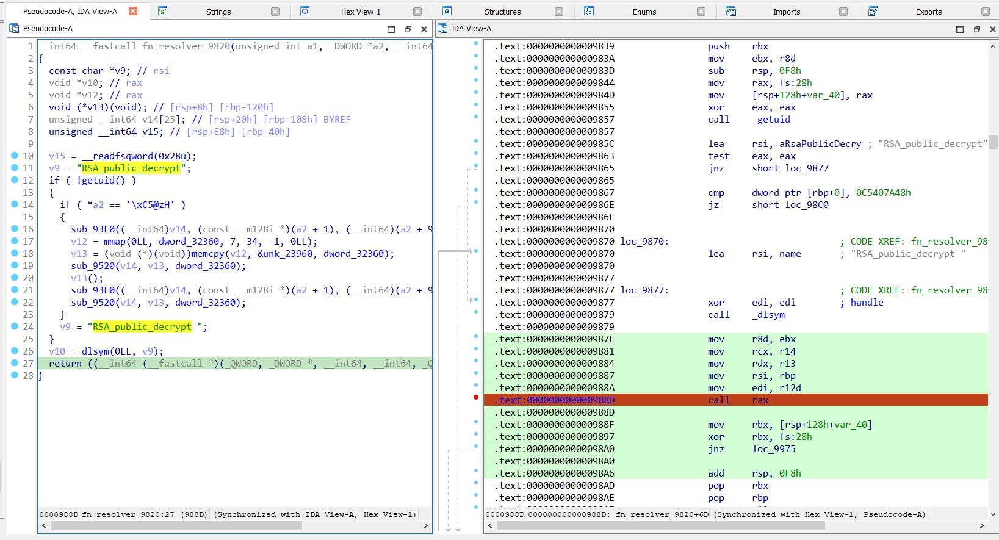
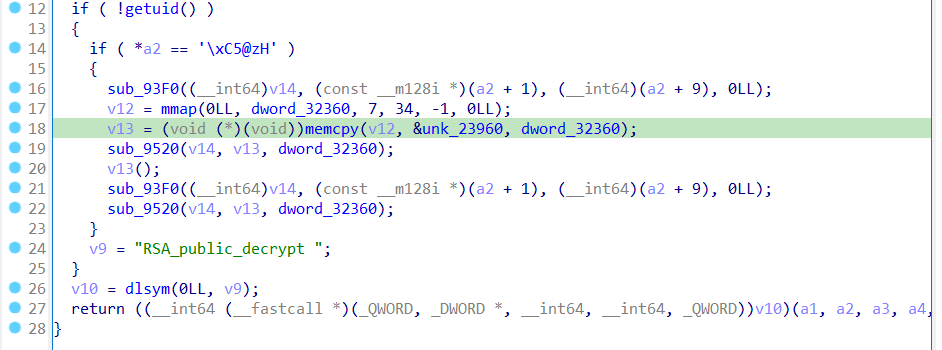
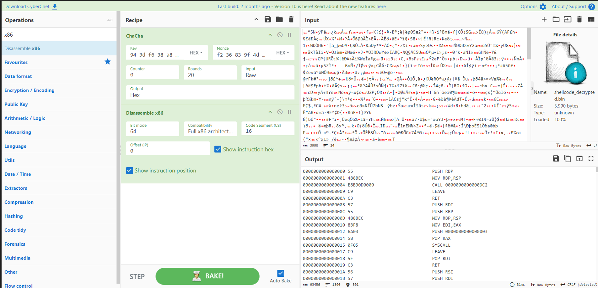
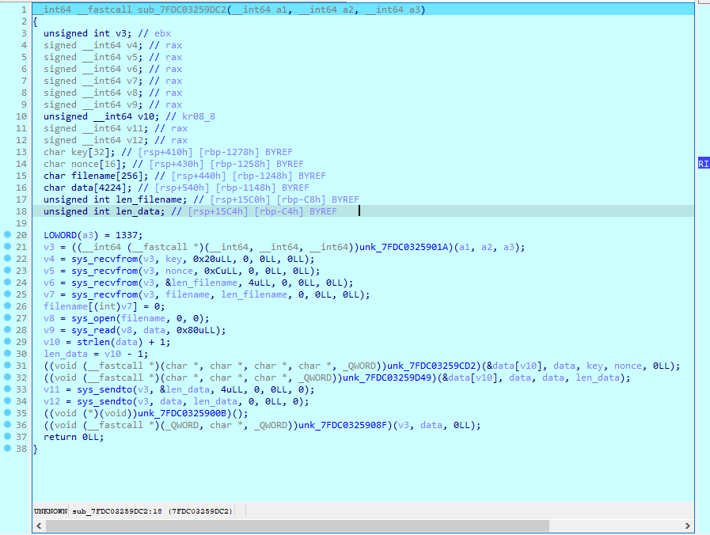
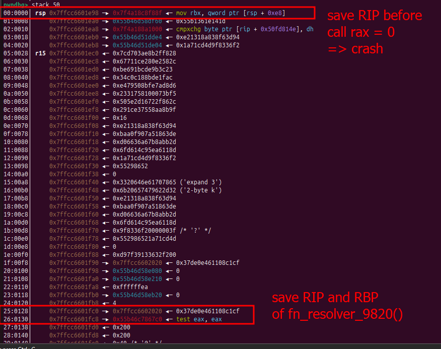
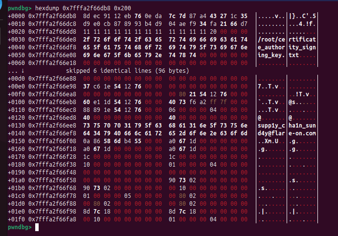

## [1]. Threat Hunting and Digital Forensics

> Máy chủ của chúng tôi tại FLARE Intergalactic HQ đã bị sập! Bây giờ bọn tội phạm đang cố gắng bán dữ liệu của tôi cho tôi!!! Hãy làm phần việc của bạn, hacker internet ngẫu nhiên, để giúp FLARE và cho chúng tôi biết dữ liệu nào chúng đã đánh cắp! Chúng tôi đã sử dụng kỹ thuật bảo quản pháp y tốt nhất là chỉ sao chép tất cả các tệp trên hệ thống cho bạn.

- Challenge mô tả rằng hệ thống của họ bị crash và cần tìm nguyên nhân của việc crash hệ thống ở đâu để phân tích nên việc đầu tiên khi tiến hành forensics hệ thống này là xem logs.

- Tiến hành tìm kiếm và đọc logs của hệ thống tại `"/var/log/*"` nhưng không có phát hiện gì (hệ thống sử dụng journal để xử lý logs nên các folder logs như message,... không xuất hiện data), sau khi tìm kiếm tại thư mục `"/var"` thì thấy có 1 file coredump khả nghi là `"sshd.core.93794.0.0.11.1725917676"`.

```bash
nigmaz@pwnable systemd/coredump » ls
sshd.core.93794.0.0.11.1725917676
nigmaz@pwnable systemd/coredump » pwd
/home/nigmaz/Downloads/flareon5/var/lib/systemd/coredump
```

- Lý do target và phân tích kỹ hơn file này là do chương trình mô tả rằng nó bị crash và file được challenge cung cấp có tên là sshd_container nên file coredump của chương trình sshd này rất khả nghi.

- Tiến hành lấy mẫu của hai file là `"sshd"` và `"sshd.core.93794.0.0.11.1725917676"` để thực hiện phân tích.

```bash
cp /home/nigmaz/Downloads/flareon5/var/lib/systemd/coredump/sshd.core.93794.0.0.11.1725917676 . && cp /home/nigmaz/Downloads/flareon5/usr/sbin/sshd .
```

- Khi phân tích file coredump mình dùng gdb (+ plugin pwndbg) để phân tích trạng thái stack frame, register và memory của sshd trước khi nó bị crash (Điều cần lưu ý ở đây là set path lib để khi gdb debug file này sẽ sử dụng lib của hệ thống bị crash - nạn nhân chứ không phải lib của máy mình đang phân tích - host).

```bash
nigmaz@pwnable ~/Downloads » gdb -q ./sshd
pwndbg> set solib-search-path /home/nigmaz/Downloads/flareon5/usr/lib/x86_64-linux-gnu
pwndbg> set sysroot /home/nigmaz/Downloads/flareon5/usr/lib/x86_64-linux-gnu
# pwndbg> set solib-search-path /home/nigmaz/Downloads/flareon5/lib/x86_64-linux-gnu
# pwndbg> set sysroot /home/nigmaz/Downloads/flareon5/lib/x86_64-linux-gnu
pwndbg> show solib-search-path
pwndbg> core sshd.core.93794.0.0.11.1725917676
# pwndbg> sharedlibrary ./liblzma.so.5.4.1
# pwndbg> info sharedlibrary
```

- Như nói ở trên những thứ có thể phân tích từ file coredump trước tiên sẽ là stack frame, register và memory. Thông qua stack frame của sshd trước khi crash có thể xác định được vị trí trong mã code - instruction của sshd bị crash ở đâu.

```bash
bt (backtrace)
info locals (show values of local variables)
info registers (show values of local variables)
frame X (show values of local variables)
up and down (navigate in the stack frame (call chain))
```

```bash
pwndbg> bt
#0  0x0000000000000000 in ?? ()
#1  0x00007f4a18c8f88f in ?? () from /home/nigmaz/Downloads/flareon5/usr/lib/x86_64-linux-gnu/liblzma.so.5.4.1
#2  0x000055b46c7867c0 in ?? ()
#3  0x000055b46c73f9d7 in ?? ()
#4  0x000055b46c73ff80 in ?? ()
#5  0x000055b46c71376b in ?? ()
#6  0x000055b46c715f36 in ?? ()
#7  0x000055b46c7199e0 in ?? ()
#8  0x000055b46c6ec10c in ?? ()
#9  0x00007f4a18e5824a in ?? () from /home/nigmaz/Downloads/flareon5/usr/lib/x86_64-linux-gnu/libc.so.6
#10 0x00007f4a18e58305 in __libc_start_main () from /home/nigmaz/Downloads/flareon5/usr/lib/x86_64-linux-gnu/libc.so.6
#11 0x000055b46c6ec621 in ?? ()
pwndbg> reg
 RAX  0
 RBX  1
 RCX  0x55b46d58e080 ◂— 0
 RDX  0x55b46d58eb20 ◂— 0
 RDI  0x200
 RSI  0x55b46d51dde0 ◂— 0x38f63d94c5407a48
 R8   1
 R9   0x7ffcc6601e10 —▸ 0x55b46d57c980 ◂— 'undefined symbol: RSA_public_decrypt '
 R10  0x1e
 R11  0x7d63ee63
 R12  0x200
 R13  0x55b46d58eb20 ◂— 0
 R14  0x55b46d58e080 ◂— 0
 R15  0x7ffcc6601ec0 ◂— 0x7cd703ae8b2ff828
 RBP  0x55b46d51dde0 ◂— 0x38f63d94c5407a48
 RSP  0x7ffcc6601e98 —▸ 0x7f4a18c8f88f ◂— mov rbx, qword ptr [rsp + 0xe8]
 RIP  0
```

- Sua khi trace các save instruction trên stack frame (back trace) thì xác định được từ mã của sshd trước khi bị crash là khi chương trình gọi `"RSA_public_decrypt()"` - RSA_public_decrypt@plt và bị crash trong hàm resolver dlsym của thư viện `"liblzma.so.5.4.1"` khi cố gắng lấy đại chỉ hàm `"RSA_public_decrypt"` từ thư viện.

```bash
pwndbg> disass 0x000055b46c7867c0-0x60, +0x80
pwndbg> disass 0x00007f4a18c8f88f-0x60, +0x80
```

```bash
sudo cp /home/nigmaz/Downloads/flareon5/usr/lib/x86_64-linux-gnu/liblzma.so.5.4.1 . && sudo chown nigmaz:nigmaz liblzma.so.5.4.1 && sudo chmod +x liblzma.so.5.4.1
```

```bash
.text:00000000000AD79C 4C 8B 4C 24 08                                                  mov     r9, [rsp+0D8h+var_D0]
.text:00000000000AD7A1 48 8B 74 24 18                                                  mov     rsi, [rsp+0D8h+var_C0]
.text:00000000000AD7A6 48 89 D9                                                        mov     rcx, rbx
.text:00000000000AD7A9 48 89 C2                                                        mov     rdx, rax
.text:00000000000AD7AC 41 B8 01 00 00 00                                               mov     r8d, 1
.text:00000000000AD7B2 41 BC EA FF FF FF                                               mov     r12d, 0FFFFFFEAh
.text:00000000000AD7B8 44 89 CF                                                        mov     edi, r9d
.text:00000000000AD7BB E8 F0 FA F5 FF                                                  call    _RSA_public_decrypt
.text:00000000000AD7BB
.text:00000000000AD7C0 85 C0                                                           test    eax, eax
```



```bash
.text:000000000000987E                 mov     r8d, ebx
.text:0000000000009881                 mov     rcx, r14
.text:0000000000009884                 mov     rdx, r13
.text:0000000000009887                 mov     rsi, rbp
.text:000000000000988A                 mov     edi, r12d
.text:000000000000988D                 call    rax
.text:000000000000988D
.text:000000000000988F                 mov     rbx, [rsp+128h+var_40]
.text:0000000000009897                 xor     rbx, fs:28h
.text:00000000000098A0                 jnz     loc_9975
.text:00000000000098A0
.text:00000000000098A6                 add     rsp, 0F8h
```



- Khi phân tích đoạn này để tiếp tục có entry phân tích sâu hơn mình tra google với hai từ khóa là `"sshd"` và `"liblzma.so.5.4.1"` thì nhận thấy có 1 CVE-2024-3094 mới đây nổi tiếng liên quan đến opensource xz rất phổ biến ("Backdoor in upstream xz/liblzma leading to SSH server compromise") Link các bài viết liên quan mình để trong phần [References](#references).

> The backdoor hook into dlresolve then hook gets called for RSA_public_decrypt to get resolved and when it does it changes its.

- Tóm lại cho logic của CVE này đó là thư viện xz/liblzma đã bị attacker commit 1 đoạn mã độc hại vào, cụ thể là resolver của hàm RSA_public_decrypt. Attacker thực hiện hook một đoạn mã vào resolver và khi đối số được truyền vào trong quá trình resolve là hợp lệ, chương trình sẽ thực hiện theo luồng thực thi giải mã và gọi shellcode thực hiện hành vi độc hại đồng thời sửa tên hàm cần resolve từ `"RSA_public_decrypt"` thành `"RSA_public_decrypt "`, đây cũng chính là lý do khiến chương trình bị crash.

- Logic trên chính là đoạn mã trong thư viện liblzma bị crash từ file coredump nên dễ dàng xác định được shellcode bị encrypted và nội dung đối số hợp lệ để thực thi follow này.

## [2]. Reverse Engineering and Analysis

- Xác định được đoạn mã bị hook và resolver, về phần các đối số trước khi hàm resolver được gọi để thỏa mãn thực thi follow này có thể xem qua từ các register của file coredump.



```bash
pwndbg> hexdump 0x55b46d51dde0 0x200
+0000 0x55b46d51dde0  48 7a 40 c5 94 3d f6 38  a8 18 13 e2 de 63 18 a5  │Hz@..=.8│.....c..│
+0010 0x55b46d51ddf0  07 f9 a0 ba 2d bb 8a 7b  a6 36 66 d0 8d 11 a6 5e  │....-..{│.6f....^│
+0020 0x55b46d51de00  c9 14 d6 6f f2 36 83 9f  4d cd 71 1a 52 86 29 55  │...o.6..│M.q.R.)U│
+0030 0x55b46d51de10  58 58 d1 b7 f9 a7 c2 0d  36 de 0e 19 ea a3 05 96  │XX......│6.......│
+0040 0x55b46d51de20  da 59 b9 b9 0d 17 8f 41  42 3d 7e eb 15 07 b5 dc  │.Y.....A│B=~.....│
+0050 0x55b46d51de30  03 9c b8 49 a8 59 98 cc  61 1f 37 9b 4d 0a f2 50  │...I.Y..│a.7.M..P│
+0060 0x55b46d51de40  bd ab 37 2d 0c 37 16 e2  a3 40 4b 11 51 ad 49 a9  │..7-.7..│.@K.Q.I.│
+0070 0x55b46d51de50  4a 1a 95 8e 26 6b 98 91  6a b0 a7 08 ee cb d0 f3  │J...&k..│j.......│
+0080 0x55b46d51de60  d2 01 47 d0 5f 9e 67 a9  f1 2d 6c 15 8d 6f a5 bd  │..G._.g.│.-l..o..│
+0090 0x55b46d51de70  32 d5 8a 17 6d 7e 61 85  16 e6 6c 31 48 14 03 8a  │2...m~a.│..l1H...│
+00a0 0x55b46d51de80  9a 4f 80 ac ea 50 68 5c  2f 74 0d 9f 00 0a b6 8a  │.O...Ph\│/t......│
+00b0 0x55b46d51de90  da 79 42 3a 70 2a 99 17  fb bd 95 53 51 63 bc 83  │.yB:p*..│...SQc..│
+00c0 0x55b46d51dea0  94 ff 7b 81 70 b7 82 64  1e 3c 1f a0 ad 4f 7a e0  │..{.p..d│.<...Oz.│
+00d0 0x55b46d51deb0  e3 81 ed bd 39 5e ab 40  10 e3 45 2d b2 dc 0f bc  │....9^.@│..E-....│
+00e0 0x55b46d51dec0  79 01 15 03 71 02 e8 2e  9f a9 15 43 06 15 a3 c3  │y...q...│...C....│
+00f0 0x55b46d51ded0  94 78 21 96 69 73 9e aa  72 1b 7c 52 32 6b 23 ad  │.x!.is..│r.|R2k#.│
+0100 0x55b46d51dee0  14 ef 31 fd 2a cf a3 ae  f9 de ca 0c b6 57 41 a7  │..1.*...│.....WA.│
+0110 0x55b46d51def0  73 ce 9f b6 60 96 3d e2  ac 4b 68 20 78 63 8e e1  │s...`.=.│.Kh.xc..│
+0120 0x55b46d51df00  71 c1 20 e6 c1 8b 87 12  a6 45 e0 48 64 1c c9 b2  │q.......│.E.Hd...│
+0130 0x55b46d51df10  81 eb 3e 3d 3e 48 54 64  83 a9 98 22 b1 86 a2 2e  │..>=>HTd│..."....│
+0140 0x55b46d51df20  84 17 25 c8 cb c9 ba 05  d2 ca 8f 1e c0 69 1f 9d  │..%.....│.....i..│
+0150 0x55b46d51df30  42 75 6f 7b 42 3e a1 9c  e6 85 df 1f 35 15 7b 10  │Buo{B>..│....5.{.│
+0160 0x55b46d51df40  11 ac 66 5d c3 f0 14 7c  c6 c5 6c a5 6b 90 c4 57  │..f]...|│..l.k..W│
+0170 0x55b46d51df50  06 83 f8 d8 69 2d ea 68  1f fb 14 77 33 ed 77 53  │....i-.h│...w3.wS│
+0180 0x55b46d51df60  77 36 27 ae c3 dc 25 57  e7 d9 5b d5 98 3b a7 84  │w6'...%W│..[..;..│
+0190 0x55b46d51df70  af 12 fb fe 06 08 70 27  2d e4 b9 01 a6 7c 5b 1e  │......p'│-....|[.│
+01a0 0x55b46d51df80  8c f7 49 74 3a ad f0 03  71 c4 96 5f ed 5d 53 3b  │..It:...│q.._.]S;│
+01b0 0x55b46d51df90  39 04 77 85 f1 84 3a fc  da be 7c 10 69 bd e7 91  │9.w...:.│..|.i...│
+01c0 0x55b46d51dfa0  d4 3a c6 bd e9 cb 0a 7b  dd c7 75 b4 00 6a 53 63  │.:.....{│..u..jSc│
+01d0 0x55b46d51dfb0  43 31 7c 3f 32 df ae 7d  d6 da 84 b5 3e c7 17 38  │C1|?2..}│....>..8│
+01e0 0x55b46d51dfc0  2b 84 67 0e fe ec a5 90  22 8d fa 00 76 a5 97 2c  │+.g.....│"...v..,│
+01f0 0x55b46d51dfd0  37 b7 1c 96 9c cc fb ce  3d c0 3c 4f e6 78 62 ad  │7.......│=.<O.xb.│
pwndbg>
```

- Search theo keyword trong hàm giải mã shellcode - keyword `"expand 32-byte k"` in function `sub_93F0()` of library `"liblzma.so.5.4.1"` => the algorithm decrypt shellcode is "chacha20". Extracted shellcode decrypt in `"liblzma.so.5.4.1"`.

- Thuật toán giả mã shellcode là `"Chacha20"`, key 32-byte là từ [4:4+32] trong data địa chỉ lưu tại register RSI ((DWORD)a2 + 1) và nonce là từ [36:36+12] ((DWORD)a2 + 9). Mình viết 1 đoạn mã để giải mã lấy shellcode.

```bash
$ pip install pycryptodome
```

```bash
#!/usr/bin/env python3
from pwn import *
import binascii
from Crypto.Cipher import ChaCha20

core = Coredump('./sshd.core.93794.0.0.11.1725917676')

log.success(f"[Pharse 1]: Analysis encrypt_shellcode in liblzma.so.5.4.1 !")

for reg, value in core.registers.items():
    log.info(f"{reg}: {hex(value)}")

log.info(f'Searched for the keyword "expand 32-byte k" in the function `sub_93F0()` of the library `liblzma.so.5.4.1`, and identified that the algorithm used to decrypt the shellcode is "chacha20".')
data = core.read(core.rsi, core.rdi)
key = data[4:4+32]
nonce = data[36:36+12]
log.info(f"Data in register [RSI] (length {len(data)}) -> {data}")
log.info(f"Key (length {len(key)}) -> {key}")
log.info(f"Nonce (length {len(nonce)}) -> {nonce}")

key_hex = ' '.join(f'{b:02x}' for b in key)
nonce_hex = ' '.join(f'{b:02x}' for b in nonce)
log.info(f"Key (hex) -> {key_hex}")
log.info(f"Nonce (hex) -> {nonce_hex}")

# for mapping in core.mappings:
#     print(mapping)
# strings = core.strings(core.rsp)
# print(strings)
# print(core.stack)

#######################################################################################################
# Dump encrypted shellcode from liblzma.so.5.4.1
start_address = 0x23960
length_shellcode = 3990

with open('liblzma.so.5.4.1', 'rb') as lib_file:
    lib_file.seek(start_address)
    encrypted_data = lib_file.read(length_shellcode)

    with open('encrypted_shellcode.bin', 'wb') as f:
        f.write(encrypted_data)
        log.success("Success: Dumped encrypted shellcode!")

cipher = ChaCha20.new(key=key, nonce=nonce)
decrypted_shellcode = cipher.decrypt(encrypted_data)
with open('decrypted_shellcode.bin', 'wb') as f:
    f.write(decrypted_shellcode)
    log.success("Success: Decrypted shellcode to file decrypted_shellcode.bin!")
```

- Hoặc có thể dump = IDA và decrypted = CyberChef .

```python
import idaapi
import binascii
start_address = 0x23960
end_address = start_address + 3990
data = idaapi.get_bytes(start_address, 3990)
with open('shellcode_decrypted.bin', 'wb') as f:
    f.write(data)
    f.close()
    print("Success dump file data!")
```



- Bây giờ mình viết loader để debug shellcode [loader.c](./sshd/loader.c), đoạn này để ý chút là trong hàm main của shellcode có đoạn lưu 4 thanh ghi rbx, rsi,rdi, r12 lên stack (Mình không rõ đoạn này quan trọng hay ảnh hưởng gì đến lúc debug hay không nhưng khi viết loader mình vẫn setup cho 4 thanh ghi này để tránh lỗi). Debug loader = IDA để hiểu logic chương trình và GDB để setup và theo dõi đối số [expl.py](./sshd/expl.py) (DÙng 1 mình IDA cũng được).



- Logic chương trình là tạo socket rồi nhận data của key, nonce, len_filename và file_name để đọc data từ trong file_name.txt sau đó sử dụng thuật toán ChaCha20 (vẫn alf từ khóa 'expand 32-byte K') sau đó ROL4 + XOR để giải mã ra flag.

- Vấn đề ở đây là địa chỉ 10.0.2.15:1337 không còn để nhận data send về nên khởi tạo socket fail và recv data cũng fail.

- Đến đây bị kẹt idea khá lâu thì mình được gợi ý là tất cả có trong file coredump. Suy nghĩ một lúc thì mình nhận ra các biến trong shellcode sử dụng stack ở địa chỉ rất thấp (hay khoảng stack sử dụng rất lớn -0x1278). Quay lại view stack thì mình có 1 phát hiện lớn.



- Từ đây mình có thể giả định được rbp của tất cả các hàm bao gồm cả shellcode được gọi từ resolver (Lý do mình chỉ giả định vì từ lúc goi shellcode đến khi gọi dlsym rồi bị crash chương trình xử lý và gọi các hàm khác có thể tương tác stack ví dụ như push hay pop lên stack khiến vị trí rbp thay đổi).

```bash
 # rbp = 0x7ffcc6601e98 - 8
pwndbg> tele 0x7ffcc6601e90-0x1278 0x50
00:0000│  0x7ffcc6600c18 ◂— '/root/certificate_authority_signing_key.txt'
01:0008│  0x7ffcc6600c20 ◂— 'rtificate_authority_signing_key.txt'
02:0010│  0x7ffcc6600c28 ◂— 'e_authority_signing_key.txt'
03:0018│  0x7ffcc6600c30 ◂— 'ity_signing_key.txt'
04:0020│  0x7ffcc6600c38 ◂— 'ing_key.txt'
05:0028│  0x7ffcc6600c40 ◂— 0xffffffff00747874 /* 'txt' */

```

- Ta có thể thấy đó là tên file, điều này khẳng định giả thuyết của mình là data của quá trình xử lý trong shellcode vẫn còn lưu trên stack. Phần filename có vị trí = [rbp - 0x1248] nên mình tính toán lại rbp đúng của shellcode và vị trí các biến khác của main shellcode.

```bash
rbp_theory = 0x7ffcc6601e98 - 8

xác định stack frame = rbp_theory - 0x1278 thì lại thấy là vị trí của filename
filename_addr = rbp_theory - 0x1278

tính lại rbp đúng của main shellcode
rbp_true = filename_addr + 0x1248

char key[32] addr = rbp_true - 0x1278
char nonce[16] addr = rbp_true - 0x1258
char filename[256] addr = rbp_true - 0x1248
char data[4224] addr = rbp_true - 0x1148
unsigned int len_filename addr = rbp_true - 0xC8
unsigned int len_data addr = rbp_true - 0xC4
```

- Bây giờ có thể dễ dàng lấy lại data bị mất và debug để lấy flag. Mình viết đoạn script python để lấy data từ file coredump.

```bash
pwndbg>  tele 0x7ffcc6601e90-0x1278-0x50 0x50
00:0000│  0x7ffcc6600bc8 ◂— 2
01:0008│  0x7ffcc6600bd0 —▸ 0x7ffcc6601130 —▸ 0x55b46c7c7157 ◂— 0x733030352e2500
02:0010│  0x7ffcc6600bd8 ◂— 0x3000000028 /* '(' */
03:0018│  0x7ffcc6600be0 —▸ 0x7ffcc66012a0 —▸ 0x55b46c7bede8 ◂— 0
04:0020│  0x7ffcc6600be8 ◂— 0xda0e76eb1291ec8d
05:0028│  0x7ffcc6600bf0 ◂— 0x351c2743a4877d7c
06:0030│  0x7ffcc6600bf8 ◂— 0xd9b4938987cbe0d9
07:0038│  0x7ffcc6600c00 ◂— 0xd76621fa34f9ae04
08:0040│  0x7ffcc6600c08 ◂— 0x1111111111111111
09:0048│  0x7ffcc6600c10 ◂— 0x2011111111
0a:0050│  0x7ffcc6600c18 ◂— '/root/certificate_authority_signing_key.txt'
0b:0058│  0x7ffcc6600c20 ◂— 'rtificate_authority_signing_key.txt'
0c:0060│  0x7ffcc6600c28 ◂— 'e_authority_signing_key.txt'
0d:0068│  0x7ffcc6600c30 ◂— 'ity_signing_key.txt'
0e:0070│  0x7ffcc6600c38 ◂— 'ing_key.txt'
0f:0078│  0x7ffcc6600c40 ◂— 0xffffffff00747874 /* 'txt' */
10:0080│  0x7ffcc6600c48 ◂— 0
11:0088│  0x7ffcc6600c50 —▸ 0x7ffcc6600df0 ◂— 0x55b400000000
12:0090│  0x7ffcc6600c58 ◂— 1
13:0098│  0x7ffcc6600c60 —▸ 0x7ffcc6601705 ◂— 0x4a18a513c0000000
14:00a0│  0x7ffcc6600c68 ◂— 0xffffffff
15:00a8│  0x7ffcc6600c70 —▸ 0x7f4a18e3dec0 ◂— 0x10001200004b23 /* '#K' */
16:00b0│  0x7ffcc6600c78 —▸ 0x7f4a19012000 —▸ 0x7f4a18e31000 ◂— 0x3010102464c457f
17:00b8│  0x7ffcc6600c80 ◂— 0
18:00c0│  0x7ffcc6600c88 ◂— 0
19:00c8│  0x7ffcc6600c90 ◂— 0x1e
1a:00d0│  0x7ffcc6600c98 —▸ 0x7f4a197849b1 ◂— mov r10d, dword ptr [rbp - 0x110]
1b:00d8│  0x7ffcc6600ca0 ◂— 0
1c:00e0│  0x7ffcc6600ca8 —▸ 0x7ffcc6601130 —▸ 0x55b46c7c7157 ◂— 0x733030352e2500
1d:00e8│  0x7ffcc6600cb0 ◂— 0xca8
1e:00f0│  0x7ffcc6600cb8 ◂— 0xca8
1f:00f8│  0x7ffcc6600cc0 ◂— 0x1000
20:0100│  0x7ffcc6600cc8 ◂— 0x3000000030 /* '0' */
21:0108│  0x7ffcc6600cd0 —▸ 0x7ffcc6602198 —▸ 0x55b46c71376b ◂— mov r15d, eax
22:0110│  0x7ffcc6600cd8 —▸ 0x7ffcc66020d0 —▸ 0x7ffcc6602120 —▸ 0x55b46d58cea0 ◂— 'test-user'
23:0118│  0x7ffcc6600ce0 —▸ 0x7ffcc6600de0 —▸ 0x7ffcc6600d50 —▸ 0x55b46d58b4d0 —▸ 0x7f4a188a2000 ◂— ...
24:0120│  0x7ffcc6600ce8 —▸ 0x7f4a1978e5ab ◂— mov rax, qword ptr [rbp + 0x3e8]
25:0128│  0x7ffcc6600cf0 —▸ 0x7f4a18e0ecfc ◂— 'ld-linux-x86-64.so.2'
26:0130│  0x7ffcc6600cf8 ◂— 0x10
27:0138│  0x7ffcc6600d00 —▸ 0x7f4a19012ae0 —▸ 0x7f4a18e0e000 ◂— 0x10102464c457f
28:0140│  0x7ffcc6600d08 ◂— 0
29:0148│  0x7ffcc6600d10 —▸ 0x7ffcc6600de0 —▸ 0x7ffcc6600d50 —▸ 0x55b46d58b4d0 —▸ 0x7f4a188a2000 ◂— ...
2a:0150│  0x7ffcc6600d18 ◂— 0x1c9e2a420834f6a9
2b:0158│  0x7ffcc6600d20 ◂— 0x8dbb709408a8030c
2c:0160│  0x7ffcc6600d28 ◂— 0x247fff247b6ddcaa
2d:0168│  0x7ffcc6600d30 ◂— 0x1d07f7929e83da7c
2e:0170│  0x7ffcc6600d38 ◂— 0x58c12e906302
2f:0178│  0x7ffcc6600d40 —▸ 0x55b46d58b4d0 —▸ 0x7f4a188a2000 ◂— 0x10102464c457f
30:0180│  0x7ffcc6600d48 —▸ 0x7f4a1978ea20 ◂— test r15b, r15b
31:0188│  0x7ffcc6600d50 —▸ 0x55b46d58b4d0 —▸ 0x7f4a188a2000 ◂— 0x10102464c457f
32:0190│  0x7ffcc6600d58 —▸ 0x7f4a1977d130 —▸ 0x7f4a196ec000 ◂— 0x10102464c457f
33:0198│  0x7ffcc6600d60 —▸ 0x7f4a1977cbf0 —▸ 0x7f4a196fe000 ◂— 0x10102464c457f
34:01a0│  0x7ffcc6600d68 —▸ 0x7f4a19012ae0 —▸ 0x7f4a18e0e000 ◂— 0x10102464c457f
35:01a8│  0x7ffcc6600d70 —▸ 0x7f4a19012000 —▸ 0x7f4a18e31000 ◂— 0x3010102464c457f
36:01b0│  0x7ffcc6600d78 —▸ 0x7f4a197b0ad0 (_rtld_global+2736) —▸ 0x7f4a1977e000 ◂— 0x3010102464c457f
37:01b8│  0x7ffcc6600d80 ◂— 0x968070c64318f8ac
38:01c0│  0x7ffcc6600d88 ◂— 0x97edcde9a64cf8ac
39:01c8│  0x7ffcc6600d90 ◂— 0x7f4a00000000
3a:01d0│  0x7ffcc6600d98 —▸ 0x7f4a196ffd12 ◂— 'libcap-ng.so.0'
3b:01d8│  0x7ffcc6600da0 ◂— 0x968070c64358f8ac
3c:01e0│  0x7ffcc6600da8 ◂— 0x97edcde9a64cf8ac
3d:01e8│  0x7ffcc6600db0 ◂— 0x7f4a00000000
3e:01f0│  0x7ffcc6600db8 —▸ 0x7f4a18e535ee ◂— 'ld-linux-x86-64.so.2'
3f:01f8│  0x7ffcc6600dc0 ◂— 0x968070c64398f8ac
```

```python
log.success(f"[Pharse 2]: Analysis shellcode in liblzma.so.5.4.1 use \"loader.c\" !")
log.success(f"Setup argv in shellcode.")
registers_to_argv_loader = ['rbx', 'rsi', 'rdi', 'r12']
for reg in registers_to_argv_loader:
    if reg in core.registers:
        value = core.registers[reg]
        log.info(f"{reg}: {hex(value)}")
    else:
        log.warning(f"{reg} not found in core dump.")


rbp_test = core.rsp - 0x8
addr_filename_shellcode = rbp_test - 0x1278
rbp_true = addr_filename_shellcode + 0x1248

key_32_addr = rbp_true - 0x1278
nonce_16_addr = rbp_true - 0x1258
filename_256_addr = rbp_true - 0x1248
buf_4224_addr = rbp_true - 0x1148

data1 = (core.read(key_32_addr, 32)).split(b'\x00', 1)[0] + b'\x00'
hex1 = ' '.join(f'{b:02x}' for b in data1)
converted1 = ''.join(f'\\x{byte}' for byte in hex1.split())

data2 = (core.read(nonce_16_addr, 16)).split(b'\x00', 1)[0]  + b'\x00'
hex2 = ' '.join(f'{b:02x}' for b in data2)
converted2 = ''.join(f'\\x{byte}' for byte in hex2.split())

data3 = (core.read(filename_256_addr, 256)).split(b'\x00', 1)[0] + b'\x00'
hex3 = ' '.join(f'{b:02x}' for b in data3)
converted3 = ''.join(f'\\x{byte}' for byte in hex3.split())

data4 = (core.read(buf_4224_addr, 0x80)).split(b'\x00', 1)[0] + b'\x00'
hex4 = ' '.join(f'{b:02x}' for b in data4)
converted4 = ''.join(f'\\x{byte}' for byte in hex4.split())

size = len(data3) - 1
size_4 = len(data4) - 1

log.info(f"key_32_addr       : {hex(key_32_addr)} - set {{char [{len(data1)}]}}(address) = \"{converted1}\"")
log.info(f"nonce_16_addr     : {hex(nonce_16_addr)} - set {{char [{len(data2)}]}}(address) = \"{converted2}\"")
log.info(f"filename_256_addr : {hex(filename_256_addr)} - set {{char [{len(data3)}]}}(address) = \"{converted3}\"")
log.info(f"buf_4224_addr     : {hex(buf_4224_addr)} - set {{char [{len(data4)}]}}(address) = \"{converted4}\"")

log.info(f'size   - set {{char [2]}}(address) = "\\x{hex(size)[-2:]}\x00"')
log.info(f'size_4 - set {{char [2]}}(address) = "\\x{hex(size_4)[-2:]}\x00"')
```

- Debug bằng gdb hoặc IDA để setup lại các giá trị đối số của hàm giải mã để lấy flag.

```bash
# gdb setup data
pwndbg> set {char [33]}(address) = "\x8d\xec\x91\x12\xeb\x76\x0e\xda\x7c\x7d\x87\xa4\x43\x27\x1c\x35\xd9\xe0\xcb\x87\x89\x93\xb4\xd9\x04\xae\xf9\x34\xfa\x21\x66\xd7\x00"
pwndbg> set {char [14]}(address) = "\x11\x11\x11\x11\x11\x11\x11\x11\x11\x11\x11\x11\x20\x00"
pwndbg> set {char [44]}(address) = "\x2f\x72\x6f\x6f\x74\x2f\x63\x65\x72\x74\x69\x66\x69\x63\x61\x74\x65\x5f\x61\x75\x74\x68\x6f\x72\x69\x74\x79\x5f\x73\x69\x67\x6e\x69\x6e\x67\x5f\x6b\x65\x79\x2e\x74\x78\x74\x00"
pwndbg> set {char [39]}(address) = "\xa9\xf6\x34\x08\x42\x2a\x9e\x1c\x0c\x03\xa8\x08\x94\x70\xbb\x8d\xaa\xdc\x6d\x7b\x24\xff\x7f\x24\x7c\xda\x83\x9e\x92\xf7\x07\x1d\x02\x63\x90\x2e\xc1\x58\x00"
pwndbg> set {char [2]}(address) = "\x2b\x00"
pwndbg> set {char [2]}(address) = "\x26\x00"
```

OR ...

```python
# IDA setup data
# Địa chỉ đích (cần thay đổi thành địa chỉ bạn muốn ghi vào)
address = 0x7ffffabcdef

# Dữ liệu byte cần ghi
data = b"\x8d\xec\x91\x12\xeb\x76\x0e\xda\x7c\x7d\x87\xa4\x43\x27\x1c\x35\xd9\xe0\xcb\x87\x89\x93\xb4\xd9\x04\xae\xf9\x34\xfa\x21\x66\xd7\x00"

# Dùng vòng lặp for để ghi từng byte một vào bộ nhớ
for i, byte in enumerate(data):
    current_address = address + i  # Tính địa chỉ hiện tại
    ida_bytes.patch_byte(current_address, byte)  # Ghi từng byte vào địa chỉ
    print(f"Write byte {hex(byte)} into address {hex(current_address)} success!")

print(f"The {len(data)} byte written into memory.")
```



> flag

## [3]. References

XZ/liblzma CVE-2024-3094

- [*] https://boehs.org/node/everything-i-know-about-the-xz-backdoor

- https://research.swtch.com/xz-script

- https://www.openwall.com/lists/oss-security/2024/03/29/4

- [*] https://www.youtube.com/watch?v=bS9em7Bg0iU&t=195s

- https://www.youtube.com/watch?v=044GiRqGebc

RSA_public_decrypt và RSA struct rsa_st { ... }

- https://github.com/openssl/openssl/blob/12d14de641c299ec080edc521f7080acc44e366f/crypto/rsa/rsa_local.h#L48

- https://hayageek.com/rsa-encryption-decryption-openssl-c/

- https://linux.die.net/man/3/rsa

Các script và lệnh bash dùng trong quá trình hunting và analysis.

- Lệnh bash để cat và strings tất cả các file trong folder (Lúc đầu dùng nó để hunting dấu hiệu khả nghi).

```bash
find . -type f -exec cat {} +

find . -type f | xargs cat

find . -type f -name "*.txt" -exec cat {} +

find . -type f -exec strings {} +

find . -type f | xargs strings
```

- Đọc nội dung của tất cả các file trong folder chỉ định (VD: `"./etc/*"` ) và lưu nó vào text (Khi hunting đoạn này có đọc xem liệu tìm được gì trong các file liên quan đến quá trình ssh không vd như private và public key nhưng không tìm được gì).

```bash
find ./etc/ -type f | while read file; do
  echo -e "\n[+]================================[+]\n[+] ==== File: $file ==== [+]\n[+]================================[+]" >> etc_content.txt
  if [ -s "$file" ]; then
    cat "$file" >> etc_content.txt
  else
    echo "None" >> etc_content.txt
  fi
done
```

- Thực hiện kiểm tra file type và objdump tất cả file trong folder (VD `"./etc/*"` )

```bash
for file in *; do
  if file "$file" | grep -q 'ELF'; then
    mv "$file" ./elf_files/
  fi
done
```

```bash
for file in *; do
  if file "$file" | grep -q 'ELF'; then
    objdump -d "$file" > "./objdump.txt"
  fi
done
```

- Binwalk file coredump để tiến hành phân tích đơn lẻ các tiến trình trong tệp dump của chương trình bị crash.

```bash
binwalk --dd='.*' sshd.core.93794.0.0.11.1725917676 >> binwalk.txt
```

- Thiết lập LD_LIBRARY_PATH hệ thống.

```bash
set sysroot /home/nigmaz/Downloads/flareon5

export LD_LIBRARY_PATH=/home/nigmaz/Downloads/flareon5/usr/lib/x86_64-linux-gnu:/home/nigmaz/Downloads/flareon5/lib/x86_64-linux-gnu:$LD_LIBRARY_PATH

echo $LD_LIBRARY_PATH

unset LD_LIBRARY_PATH
```

- Thông tin máy thực hiện dựng challenge.

```bash
nigmaz@pwnable Downloads/flareon5 » cat ./etc/os-release
PRETTY_NAME="Debian GNU/Linux 12 (bookworm)"
NAME="Debian GNU/Linux"
VERSION_ID="12"
VERSION="12 (bookworm)"
VERSION_CODENAME=bookworm
ID=debian
HOME_URL="https://www.debian.org/"
SUPPORT_URL="https://www.debian.org/support"
BUG_REPORT_URL="https://bugs.debian.org/"
nigmaz@pwnable Downloads/flareon5 »
```

- Danh sách các thư viện được load khi sshd chạy.

```bash
nigmaz@pwnable ~/Downloads » ldd ./sshd                                                                                                                                                                                                                          255 ↵
	linux-vdso.so.1 (0x00007fff16982000)
	libcrypt.so.1 => /lib/x86_64-linux-gnu/libcrypt.so.1 (0x000072cb6249c000)
	libwrap.so.0 => /lib/x86_64-linux-gnu/libwrap.so.0 (0x000072cb62490000)
	libaudit.so.1 => /lib/x86_64-linux-gnu/libaudit.so.1 (0x000072cb62462000)
	libpam.so.0 => /lib/x86_64-linux-gnu/libpam.so.0 (0x000072cb62451000)
	libsystemd.so.0 => /lib/x86_64-linux-gnu/libsystemd.so.0 (0x000072cb62371000)
	libselinux.so.1 => /lib/x86_64-linux-gnu/libselinux.so.1 (0x000072cb62342000)
	libgssapi_krb5.so.2 => /lib/x86_64-linux-gnu/libgssapi_krb5.so.2 (0x000072cb622ee000)
	libkrb5.so.3 => /lib/x86_64-linux-gnu/libkrb5.so.3 (0x000072cb62225000)
	libcom_err.so.2 => /lib/x86_64-linux-gnu/libcom_err.so.2 (0x000072cb6221f000)
	libcrypto.so.3 => /lib/x86_64-linux-gnu/libcrypto.so.3 (0x000072cb61c00000)
	libz.so.1 => /lib/x86_64-linux-gnu/libz.so.1 (0x000072cb62203000)
	libc.so.6 => /lib/x86_64-linux-gnu/libc.so.6 (0x000072cb61800000)
	libcap-ng.so.0 => /lib/x86_64-linux-gnu/libcap-ng.so.0 (0x000072cb621f9000)
	libcap.so.2 => /lib/x86_64-linux-gnu/libcap.so.2 (0x000072cb621ec000)
	libgcrypt.so.20 => /lib/x86_64-linux-gnu/libgcrypt.so.20 (0x000072cb61ab8000)
	liblz4.so.1 => /lib/x86_64-linux-gnu/liblz4.so.1 (0x000072cb621ca000)
	liblzma.so.5 => /lib/x86_64-linux-gnu/liblzma.so.5 (0x000072cb62196000)
	libzstd.so.1 => /lib/x86_64-linux-gnu/libzstd.so.1 (0x000072cb61746000)
	/lib64/ld-linux-x86-64.so.2 (0x000072cb62623000)
	libpcre2-8.so.0 => /lib/x86_64-linux-gnu/libpcre2-8.so.0 (0x000072cb61a1e000)
	libk5crypto.so.3 => /lib/x86_64-linux-gnu/libk5crypto.so.3 (0x000072cb6216a000)
	libkrb5support.so.0 => /lib/x86_64-linux-gnu/libkrb5support.so.0 (0x000072cb6215d000)
	libkeyutils.so.1 => /lib/x86_64-linux-gnu/libkeyutils.so.1 (0x000072cb62154000)
	libresolv.so.2 => /lib/x86_64-linux-gnu/libresolv.so.2 (0x000072cb62141000)
	libgpg-error.so.0 => /lib/x86_64-linux-gnu/libgpg-error.so.0 (0x000072cb6211c000)
```

- Logs lệnh khi debug từ chương trình gốc sshd vào đến thư viện liblzma rồi đến shellcode độc hại.

```bash
$ LD_PRELOAD=/home/nigmaz/Downloads/flareon5/usr/lib/x86_64-linux-gnu/liblzma.so.5.4.1 gdb ./sshd

pwndbg> set solib-search-path /home/nigmaz/Downloads/flareon5/usr/lib/x86_64-linux-gnu
pwndbg> set sysroot /home/nigmaz/Downloads/flareon5/usr/lib/x86_64-linux-gnu
pwndbg> start
# pwndbg> break RSA_public_decrypt@plt
# Breakpoint 3 at 0x5555555612b0
# pwndbg> x/2i 'RSA_public_decrypt@plt'
pwndbg> vmmap
pwndbg> reg
pwndbg> set $rip=0x00000000000AD79C+0x555555554000
pwndbg> context
# Set register argument = register argument in file core-dump
pwndbg> set $rdi=0x200
pwndbg> set $rsi=0x55b46d51dde0
pwndbg> set $rdx=0x55b46d58eb20
pwndbg> set $rcx=0x55b46d58e080
pwndbg> set $r8=0x1
pwndbg> si
# ...
# Debug getuid()
pwndbg> set $rax = 0
```
